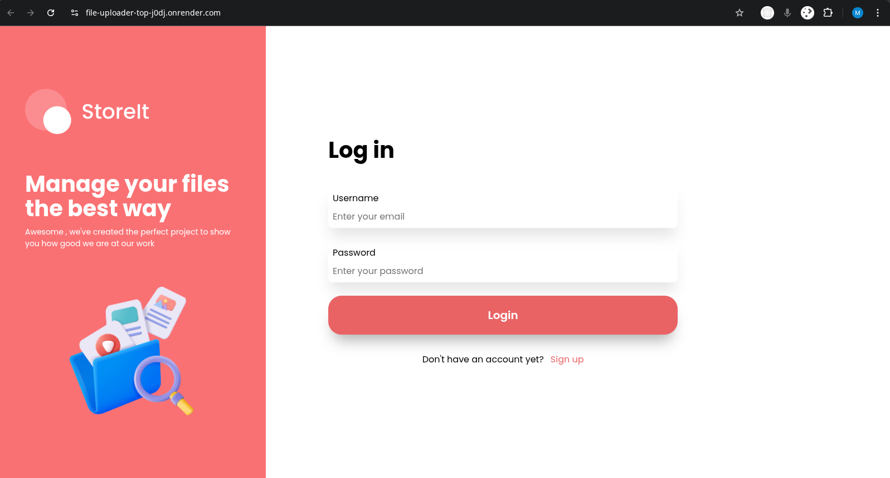
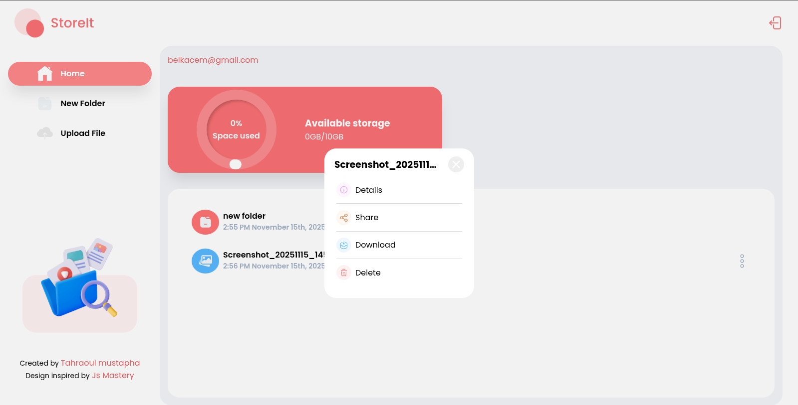

# File-Uploader-TOP

**File Uploader** is a web application built with Express using Prisma, Postgres, Passportjs and EJS template .this tool makes it easy to handle file uploads in your project or share files with others.

https://file-uploader-top-j0dj.onrender.com

## Features

- Secure user authentication with Passport.js and Prisma Session Store
- Real-time form validation providing live feedback in forms.
- Securely file uploads, downloads with Multer ,Supabase storage  
- Folder and file management (create, store, organize, delete )
- Share folders , files using a public access interface
- Set expiration dates for shared folders and files.
- Protected against common vulnerabilities with Helmet.

## Technologies Used

- **Backend:** Node.js, Express.js  
- **Database:** PostgreSQL + Prisma ORM  
- **Authentication:** Passport.js   
- **File Storage:** Multer, Supabase storage  
- **Frontend:** EJS Template, CSS  
- **Validation:** express-validator  
- **Sessions:** express-session  
- **Deployment (PaaS):** Render (server + database)
- **Additional libraries:** helmet (security), compression (fast responses)

